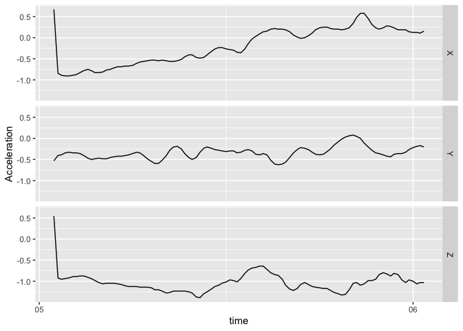

<!-- README.md is generated from README.Rmd. Please edit that file -->

# bis620.2023

<!-- badges: start -->

[](https://github.com/sahil-681/bis620.2023/actions/workflows/R-CMD-check.yaml)
[](https://github.com/sahil-681/bis620.2023/actions/workflows/test-coverage.yaml)
<!-- badges: end -->

The goal of bis620.2023 is to create an R package which is developed
specifically for the BIS620 class in 2023. This package serves as a
comprehensive toolkit for querying, analyzing, and visualizing clinical
trials data, with a focus on clinical trials information. It comprises a
suite of functions and a Shiny application, offering robust tools for
data manipulation and interactive data exploration.

Here are the key components of this package:

- query_kwds: Facilitates data querying based on specific keywords.

- plot_phase_histogram: Generates histograms for clinical trials’
  phases.

- get_concurrent_trials: Retrieves the count of concurrent trials for
  specified dates.

- plot_concurrent_trials: Visualizes the number of concurrent clinical
  trials over time.

- plot_condition_histogram: Creates histograms for various study
  conditions in the trials.

- plot_sponsor_type_overview: Provides a graphical overview of different
  sponsor types.

- launchApp: Includes an interactive Shiny application for dynamic data
  exploration. The app connects to a DuckDB database, enabling
  interactive querying and visualization of clinical trials data.

## Installation

You can install the development version of bis620.2023 from
[GitHub](https://github.com/) with:

``` r
# install.packages("devtools")
devtools::install_github("sahil-681/bis620.2023")
```

## Example

This is a basic example which shows you how to solve a common problem:

``` r
library(bis620.2023)
accel |> 
  head(100) |>
  plot_accel()
```


